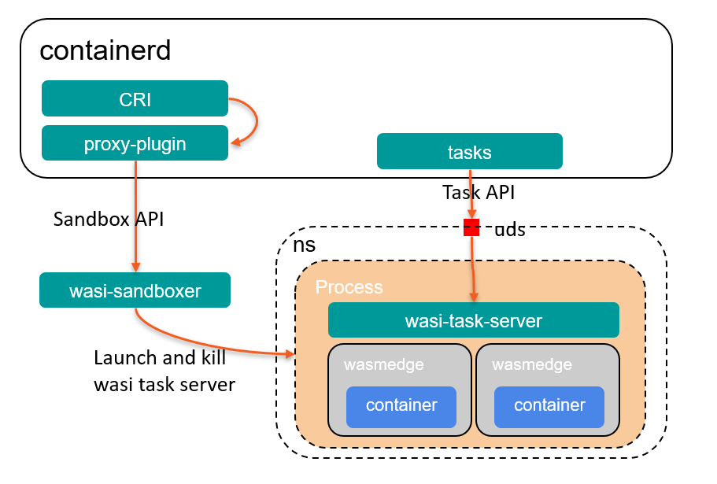

# What is Kuasar?

Kuasar is a collection of container sandboxers, written in rust, that provides various levels of security isolation for 
container. A `sandboxer` is an external plugin of containerd, based on the new sandbox plugin mechanism, that provides 
APIs of sandbox lifecycle management, such as `Create`, `Start` `Stop` and `Shutdown`, and also operations related with 
containers, such as `Prepare`, `Purge`. Each sandboxer implementation has its own method to isolate the containers
inside the sandbox. Three secure sandboxer implementations are included in Kuasar organizations recently, `vmm`, `quark`
and `wasi`.

`vmm` and `quark` sandboxes isolate containers based on the kvm hypervisor, `vmm` provides complete VMs and Linux
kernels based on open-source virtualization components, such as qemu and cloud-hypervisor. `quark` will launch a kvm 
virtual machine and a guest kernel by itself, without any application level hypervisor and Linux, therefore, more 
aggressive optimization can be made to speed up the startup processing, to reduce the memory overhead, and to speed up 
IO and network. The tests show its performance can be comparable to that of runc, or even bare metal.

`wasi` sandbox isolates containers in WebAssembly runtime(wasmedge).

# Why Kuasar?

"Sandbox" becomes the first class citizen in containerd after the sandbox plugin mechanism was introduced to containerd, 
a sandbox is an isolated environment for running multiple containers. We can implement a variety of "sandboxer" based on 
the sandbox API with different kinds of isolation technique such as hypervisor, webassembly or user mode kernel. 
The advantage brought by the introduction of sandbox is that the shim process can be removed as it is not necessary.

Kuasar provides some sandboxer implementations written in rust. rust is a language of excellent performance while having
strict memory security guarantees. The three sandboxer, `vmm`, `quark` and `wasi`, are all proved to be secure isolation 
techniques, which can be running in the multi-tenant environment. `vmm` provides a relatively completed Linux 
environment, `quark` focuses on its startup time, memory overhead and IO performance, `wasi` is extremely lightweight 
but maybe not that compatible with processes running in Unix-like OS. Applications can choose their appropriate
sandboxer based on their requirement.

# Kuasar Architecture

For the vmm based sandbox, the introduction of sandboxer has removed the shim process on host, making one process for 
one pod, which makes the architecture cleaner, and easier to maintain.


[Quark](https://github.com/QuarkContainer/Quark) has its own hypervisor called `QVisor` and kernel called `QKernel`, 
with rewriting of these components it can achieve a much better performance compared with that of a common hypervisor 
and a common linux kernel.

Wasi sandboxer runs containers in a WebAssembly runtime, currently [wasmedge](https://github.com/WasmEdge/WasmEdge) supported. 
Everytime when containerd has to start a container in sandbox, the wasi-task-server will fork a new process, start a new 
wasmedge runtime and run wasm codes inside it. All containers in a same pod will share the same ns/cgroup resources with 
the wasi-task-server process.


Besides these three sandboxers, Kuasar is also a developing platform, that more sandboxers can be built on.

# Sandboxer in containerd

There is a containered issue talking about sandboxer mechanism: https://github.com/containerd/containerd/issues/7739.

A community recoding and a slide were attached in this [comment](https://github.com/containerd/containerd/issues/7739#issuecomment-1384797825).

# Quick Start

## prerequisites

### 1. OS
The lowest linux distro versions that kuasar supports:
1. Ubuntu 22.04
2. CentOS 8

Quark should run on linux kernel with version higher than 5.15.

### 2. rust
rust 1.67 or higher version is required to compile kuasar sandboxers

To install rust:
```
curl --proto '=https' --tlsv1.2 -sSf https://sh.rustup.rs | sh -s -- -y
source "$HOME/.cargo/env"
```
### 3. containerd
kuasar sandboxers are all external plugins of containerd, containerd and its CRI plugin is required to manage the 
sandboxes and containers.

To install containerd, please refer to https://github.com/containerd/containerd/blob/main/docs/getting-started.md.

### 4. cloud-hypervisor
A hypervisor should be installed on host if you want to launch a vmm based sandbox. Although vmm-sandboxer supports 
both qemu and cloud-hypervisor as its hypervisor. we suggest to install cloud-hypervisor as default.

To install cloud-hypervisor, please refer to https://github.com/cloud-hypervisor/cloud-hypervisor/blob/main/docs/building.md

### 5. Quark
If you want to try the Quark sandboxer, the QuarkContainer should be installed.
To build and install Quark, please refer to https://github.com/QuarkContainer/Quark

After installation, we should change the `Sandboxed` config to `true` in the `/etc/quark/config.json`:

```json
{
  "DebugLevel"    : "Error",
  "KernelMemSize" : 24,
  "LogType"       : "Sync",
  "LogLevel"      : "Simple",
  "UringIO"       : true,
  "UringBuf"      : true,
  "UringFixedFile": false,
  "EnableAIO"     : true,
  "PrintException": false,
  "KernelPagetable": false,
  "PerfDebug"     : false,
  "UringStatx"    : false,
  "FileBufWrite"  : true,
  "MmapRead"      : false,
  "AsyncAccept"   : true,
  "EnableRDMA"    : false,
  "RDMAPort"      : 1,
  "PerSandboxLog" : false,
  "ReserveCpuCount": 1,
  "ShimMode"      : false,
  "EnableInotify" : true,
  "ReaddirCache"  : true,
  "HiberODirect"  : true,
  "DisableCgroup" : true,
  "CopyDataWithPf": true,
  "TlbShootdownWait": true,
  "Sandboxed": true
}
```

Make sure the `ShimMode` is false, and `Sandboxed` is true in the config file.

### 6. wasmedge
Wasi-sandboxer supports wasmedge to start WebAssembly sandboxes currently, wasmedge should be installed if 
wasi-sandboxer is needed.

To install wasmedge, please refer to https://wasmedge.org/book/en/quick_start/install.html

## build from source

```
cd kuasar
make all
make install
```

## start kuasar sandboxers


## configure containerd
After installed kuasar, we need to configure containerd to start containers by kuasar.

```toml
[proxy_plugins]
  [proxy_plugins.vmm]
    type = "sandbox"
    address = "/run/vmm-sandboxer.sock"
  [proxy_plugins.quark]
    type = "sandbox"
    address = "/run/quark-sandboxer.sock"
  [proxy_plugins.wasi]
    type = "sandbox"
    address = "/run/wasi-sandboxer.sock"

[plugins.cri.containerd.runtimes.vmm]
  runtime_type = "io.containerd.kuasar.v1"
  sandboxer = "vmm"
  io_type = "hvsock"
[plugins.cri.containerd.runtimes.wasi]
  runtime_type = "io.containerd.wasi.v1"
  sandboxer = "wasi"
[plugins.cri.containerd.runtimes.quark]
  runtime_type = "io.containerd.quark.v1"
  sandboxer = "quark"
```

Three proxy plugins and three container runtimes are added to the config. Then run restart container by 
`systemctl restart containerd`.

## Contact

If you need support, start with the [troubleshooting guide](), and work your way through the process that we've outlined.

If you have questions, feel free to reach out to us in the following ways:

- [mailing list]()
- [slack]()
- [twitter]()

## Contributing

If you're interested in being a contributor and want to get involved in developing the kuasar code, please see
[CONTRIBUTING](CONTRIBUTING.md) for details on submitting patches and the contribution workflow.

## Security

### Security Audit
TODO

### Reporting security vulnerabilities

We do encourage security researchers, industry organizations and users to proactively report suspected vulnerabilities
to our security team, the team will help diagnose the severity of the issue and determine how to address the issue as 
soon as possible.

For further details please see [Security Policy](SECURITY.md) for our security process and how to report vulnerabilities.

## License

Kuasar is under the Apache 2.0 license. See the [LICENSE](LICENSE) file for details.

Kuasar's documentation is under the [CC-BY-4.0 license](https://creativecommons.org/licenses/by/4.0/legalcode).