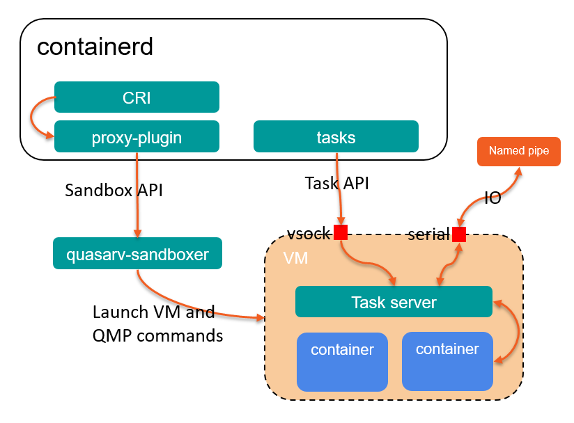
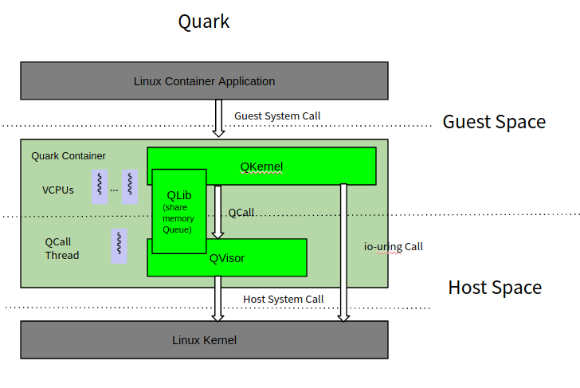

# What is Kuasar?

Kuasar is a collection of container sandboxers, written in rust, that provides various levels of security isolation for container. A `sandboxer` is an external plugin of containerd, based on the new sandbox plugin mechanism, that provides APIs of sandbox lifecycle management, such `Start` and `Shutdown`, and operations related with containers, suce as `AppendContainer`, `RemoveContainer`. Each sandboxer implementation has it's own method to isloate the containers in the sandbox. Two secure sandboxer implementions is included in Kuasar organizations recently, `kuasarvm` and `quark`, both isolates containers based on the kvm hypervisor, `kuasarvm` provides complete VMs and Linux kernels based on open-source virtualization components, such as qemu and cloud-hypervisor. quark will launch a kvm virtual machine and a guest kernel by itself, without any application level hypervisor and Linux, therefore, more aggresive optimization can be made to speed up the startup, to reduce the memory overhead, and to speed up IO and netowrk. The tests shows it's performance can be comparable to that of runc, or even baremetal.

# Why Kuasar?

"Sandbox" becomes the first class citizen in containerd after the sandbox plugin mechanism is introduced to containerd, a sandbox is an isolated environment for running multiple containers. we can implements a variety of "sandboxer" based on the sandbox API with different kind of isolation technique such as hypervisor, webassembly or eBPF. the advantage brought by the introduction of sandbox is that we can remove the shim process when it is not neccessary.

Kuasar provides our own sandboxer implementations written in rust, which is a language of excellent performance while having strict memory security guarantees. The two sandboxer, `kuasarvm` and `quark`,  are both based on the hypervisor isolation, which can both be running in the multi-tenant environment. `kuasarvm` provides a relatively complete Linux environment, while `quark` focuses on it startup time, memory overhead and IO performance. Applications can choose their appropriate sandboxer based on their requirement.

# Kuasar Architecture

The introduction of sandboxer removes the shim process on host, and make one process for one pod, which makes the architecture clean, and easier to maintain.

Quark has it's own hypervisor called `QVisor` and kernel called `QKernel`, with rewritting of these components it can achieve a much better performance compared with that of a common hypervisor and a common linux kernel.

Besides the two sandboxers, Kuasar also a development platform, that more sandboxers can be built on, like WebAssembly sandboxer or eBPF sandboxer.

