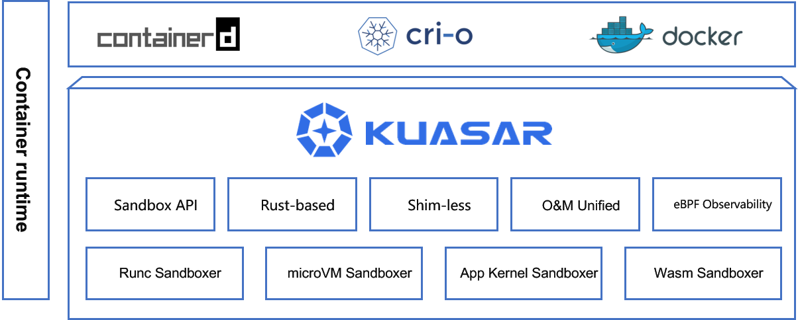
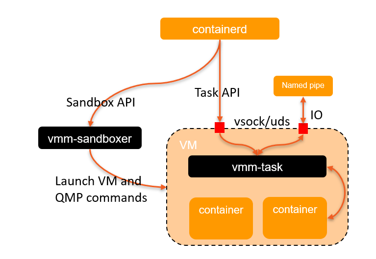
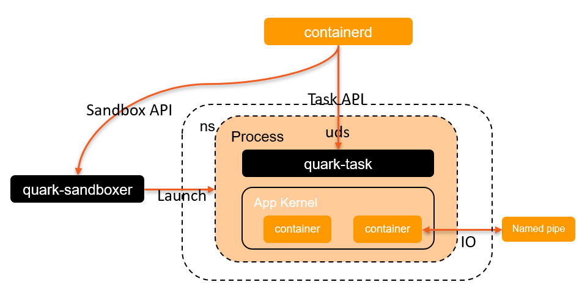
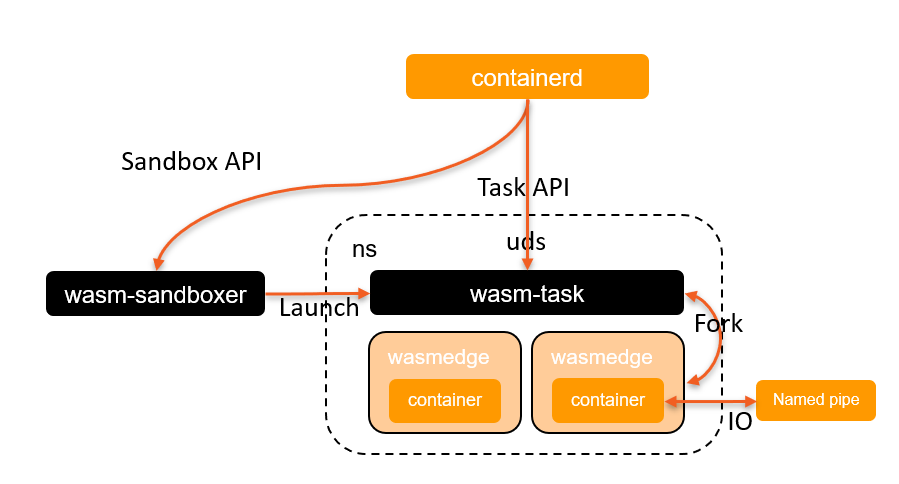

Kuasar, written in Rust, is a high-performance container runtime working to run containers based on multiple sandboxing techniques including microVM, app kernel and webassembly, etc.


# Why Kuasar?

After the introduction of the sandbox plugin mechanism, "sandbox" has become the first-class citizen in containerd. A sandbox is an isolated environment used for running multiple containers, with these different types of isolation techniques available,  a variety of "sandboxer" can be implemented based on sandbox API in containerd. This change has allowed for the removal of the shim process, which is no longer necessary.

Kuasar offers several sandboxer implementations. Currently there are three available sandboxers, `vmm`, `quark` and `wasm`, that have all been proven to be secure isolation techniques suitable for use in a multi-tenant environment. Besides, `runc` sandboxer implementation is already on the schedule. Kuasar makes it possiable for applications to run under the most appropriate sandboxer based on their specific requirements.

Compared with traditional container runtimes, Kuasar has the following advantages:

- **Efficient Sandbox API Server**:  
  + Provide a more developer-friendly framework by Sandbox API.
  + Reduce management resource overhead due to the removal of the shim process, please refer to [Performance](#Performance) .
- **Multi-Sandbox Colocation**: Kuasar provides secure and isolated colocation solutions, allows to run different runtimes in the same node, which will improve node resource utilization.
- **Open Ecosystem**: Kuasar support mainstream sandboxes, always stay unbiased and seamless integration.

# Kuasar Architecture



Kuasar comprises a collection of container sandboxers which are external plugins of containerd built on the new sandbox plugin mechanism. These sandboxers provide
APIs for managing the sandbox lifecycle, such as `Create`, `Start` `Stop` and `Shutdown`. They also handle operations related to containers, such as `Prepare`, `Purge`. Each implementation of the sandboxers in Kuasar utilizes its own isolation techniques for the containers within the sandbox. Recently, Kuasar has included three secure sandboxer implementations - `vmm`, `quark` and `wasm`. A discussion about the sandboxer mechanism in containerd has been raised in [Github issue](https://github.com/containerd/containerd/issues/7739), with a community meeting recoding and slide attached in this [comment](https://github.com/containerd/containerd/issues/7739#issuecomment-1384797825).

`vmm` and `quark` sandboxes isolate containers based on the kvm hypervisor. `vmm` provides complete VMs and Linux kernels based on open-source virtualization components such as Cloud Hypervisor and QEMU. `quark` launches a KVM virtual machine and a guest kernel without any application level hypervisor and Linux, allowing for more aggressive optimization to speed up startup processing, reduce memory overhead, and improve IO and network performance. Tests have shown that its performance can be comparable to that of runc or even bare metal.

The `wasm` sandbox in Kuasar isolates containers within the WebAssembly runtime (wasmedge).

## MicroVM Sandboxer

The vmm-based sandbox in Kuasar eliminates the need for the shim process on the host, resulting in one process per pod and a cleaner, more manageable architecture.


## App Kernel Sandboxer

Quark is a novel application kernel sandbox that utilizes its own hypervisor called `QVisor` and a custom kernel called `QKernel`. With customizations made to these components, Quark can achieve significantly better performance compared to traditional hypervisors. For those interested, the source code for Quark can be found on its [GitHub page](https://github.com/QuarkContainer/Quark).

The quark sandboxer start a  process with `quark-task` and an app kernel named `Qkernel`. Whenever containerd needs to start a container in the sandbox, the `quark-task` will call `Qkernel` to start a new container in it. All containers within the same pod will lie in the same process.



## Wasm Sandboxer

The Wasm sandboxer executes containers within a WebAssembly runtime, currently with support for [wasmedge](https://github.com/WasmEdge/WasmEdge). Whenever containerd needs to start a container in the sandbox, the `wasm-task` will fork a new process, start a new wasmedge runtime, and run the Wasm code inside it. All containers within the same pod will share the same ns/cgroup resources with the `wasm-task` process.



In addition to these three sandboxers, Kuasar is also a platform under active development, which means that more sandboxers can be built on top of it.

# Performance

Two performance metrics have been established: E2E batch containers startup time and management process memory consumption. Detailed test scripts, test data, and results can be found in [benchmark test](tests/benchmark/Benchmark.md), which demonstrates that Kuasar has a significant advantage over open-source [Kata-containers](https://github.com/kata-containers/kata-containers) in terms of both startup speed and memory consumption.

# Quick Start

## Prerequisites

### 1. OS
The lowest versions of Linux distributions that Kuasar supports are:
+ Ubuntu 22.04
+ CentOS 8

*Note: Quark should run on linux kernel >= 5.15.*

### 2. Sandbox

 + Cloud Hypervisor: To launch a vmm based sandbox, a hypervisor must be installed on the host. While vmm-sandboxer supports both QEMU and Cloud Hypervisor as hypervisors, we recommend [installing Cloud Hypervisor](https://github.com/cloud-hypervisor/cloud-hypervisor/blob/main/docs/building.md) as the default option.
+ Quark: See [installation](docs/quark/README.md).
+ WasmEdge: If you want to use wasm-sandboxer to start WebAssembly sandboxes, you need to install wasmedge. To install wasmedge, please refer to [install.html](https://wasmedge.org/book/en/quick_start/install.html).

### 3. containerd

Kuasar sandboxers are external plugins of containerd, so both containerd and its CRI plugin are required to manage the sandboxes and containers.

We offer two ways to interact Kuasar with containerd:

+ If the full Kuasar experience is considerated, please install [our containerd under kuasar-io organization](docs/vmm/README.md#Building containerd) and configure containerd using the following configuration.

```toml
[proxy_plugins]
  [proxy_plugins.vmm]
    type = "sandbox"
    address = "/run/vmm-sandboxer.sock"
  [proxy_plugins.quark]
    type = "sandbox"
    address = "/run/quark-sandboxer.sock"
  [proxy_plugins.wasm]
    type = "sandbox"
    address = "/run/wasm-sandboxer.sock"

[plugins.cri.containerd.runtimes.vmm]
  runtime_type = "io.containerd.kuasar.v1"
  sandboxer = "vmm"
  io_type = "hvsock"
[plugins.cri.containerd.runtimes.wasm]
  runtime_type = "io.containerd.wasm.v1"
  sandboxer = "wasm"
[plugins.cri.containerd.runtimes.quark]
  runtime_type = "io.containerd.quark.v1"
  sandboxer = "quark"
```

+ If compatibility is a concern, you need to install official containerd v1.7.0 and use [kuasar-shim](shim) for request forwarding,  see [here](shim/README.md).

Note: Due to containerd Sandbox API design, containerd should start with an enviroment variable `ENABLE_CRI_SANDBOXES=1`.

## Build Kuasar from source

Rust 1.67 or higher version is required to compile Kuasar sandboxers.

```shell
git clone https://github.com/kuasar-io/kuasar.git
cd kuasar
make all
make install
```

## Start Kuasar

Launch the sandboxers by the following commands:

`vmm-sandboxer --listen /run/vmm-sandboxer.sock --dir /run/kuasar-vmm`

`quark-sandboxer --listen /run/quark-sandboxer.sock --dir /run/kuasar-quark`

`wasm-sandboxer --listen /run/wasm-sandboxer.sock --dir /run/kuasar-wasm`

## Start Container

Container can be started by `crictl `, `ctr` or CRI rpc call to containerd.

+ Start vmm container:  [](docs/vmm/README.md#Start Container)
+ Start quark container:  [](docs/quark/README.md#Start Container)
+ Start wasm container:  [](docs/wasm/README.md#Start Container)

# Contact

If you need support, start with the [troubleshooting guide](), and work your way through the process that we've outlined.

If you have questions, feel free to reach out to us in the following ways:

- [mailing list]()
- [slack]()
- [twitter]()

# Contributing

If you're interested in being a contributor and want to get involved in developing the Kuasar code, please see [CONTRIBUTING](CONTRIBUTING.md) for details on submitting patches and the contribution workflow.

# License

Kuasar is under the Apache 2.0 license. See the [LICENSE](LICENSE) file for details.

Kuasar's documentation is under the [CC-BY-4.0 license](https://creativecommons.org/licenses/by/4.0/legalcode).