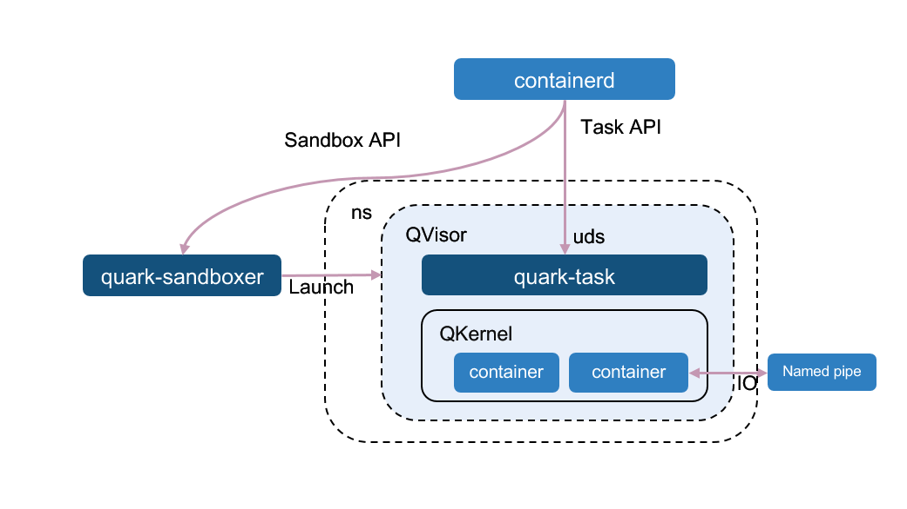
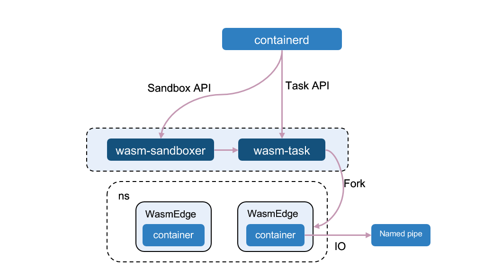

Kuasar, written in Rust, is a high efficiency container runtime working to run containers based on multiple sandbox techniques including microVM, application kernel and webassembly, etc.


# Why Kuasar?

A sandbox can be used to separate container processes from each other, and from the operating system itself. After the introduction of the [Sandbox API](https://github.com/containerd/containerd/issues/4131), sandbox has become the first-class citizen in containerd. With more and more sandbox technologies available in container world, a variety of "sandboxers" can be implemented in containerd.

Kuasar offers several sandboxer implementations, making it possible for applications to run under the most appropriate sandboxer based on its specific requirements.

Compared with other container runtimes, Kuasar has the following advantages:

- **Efficient Sandbox API Server**:
  + Provide a more developer-friendly framework by Sandbox API.
  + Reduce management resource overhead due to the removal of the shim process, please refer to [Performance](#Performance).
- **Multi-Sandbox Colocation**: Kuasar provides secure and isolated colocation solutions, allows to run different runtimes in the same node, which will improve node resource utilization.
- **Open Ecosystem**: Kuasar supports mainstream sandboxes, always stay unbiased and seamless integration.

# Kuasar Architecture


Kuasar comprises a collection of sandboxers which are external plugins of containerd built on the new sandbox plugin mechanism. Each sandboxer utilize its own isolation techniques for the containers within the sandbox. They not only provide APIs for managing the sandbox lifecycle, such as `Create`, `Start` `Stop` and `Shutdown`, but also handle operations related to containers, such as `Prepare`, `Purge`. A discussion about the sandboxer mechanism in containerd has been raised in [GitHub issue](https://github.com/containerd/containerd/issues/7739), with a community meeting recoding and slide attached in this [comment](https://github.com/containerd/containerd/issues/7739#issuecomment-1384797825). Now this feature has been put into 2.0 milestone.

Currently, Kuasar offers three types of sandboxers - **microVM sandboxer**, **App kernel sandboxer** and **Wasm sandboxer** - all of which have been proven to be secure isolation techniques in a multi-tenant environment. The sandboxer architecture consists of two processes: one implements the Sandbox API to launch sandboxes, while the other implements the Task API to start containers.

Additionally, Kuasar is also a platform under active development, and we welcome more sandboxers can be built on top of it, such as Runc sandboxer.

## MicroVM Sandboxer

The MicroVM sandboxer consists of two processes: `vmm-sandboxer`, responsible for launching VMs and calling APIs, and `vmm-task`, responsible for forking container processes.

The VM process provides complete micro virtual machines and Linux kernels based on open-source virtualization components such as [Cloud Hypervisor](https://www.cloudhypervisor.org/), [Firecracker](https://firecracker-microvm.github.io/) and [QEMU](https://www.qemu.org/).

The microVM sandboxer eliminates the need for the shim process on the host, resulting in a cleaner and more manageable architecture with only one process per pod.


*Please note that both Cloud Hypervisor and QEMU are currently supported.*

## App Kernel Sandboxer

The app kernel sandbox differs from the microVM sandbox in that it launches a KVM virtual machine and a guest kernel without any application-level hypervisor or Linux. This allows for more aggressive optimization to speed up startup processing, reduce memory overhead, and improve IO and network performance. Examples of such app kernel sandboxes include [gVisor](https://gvisor.dev/) and [Quark](https://github.com/QuarkContainer/Quark).

Quark is a unique application kernel sandbox that utilizes its own hypervisor named `QVisor` and a customized kernel called `QKernel`. With tailored modifications to these components, Quark can achieve notably better performance compared to Runc or even bare metal.

The `quark-sandboxer` starts `Qvisor` and an app kernel named `Qkernel`. Whenever containerd needs to start a container in the sandbox, the `quark-task` in `QVisor` will call `Qkernel` to launch a new container. All containers within the same pod will be running within the same process.



*Please note that only Quark is currently supported.*

## Wasm Sandboxer

The Wasm sandbox is extremely lightweight but may have constraints for applications at present, such as [WasmEdge](https://wasmedge.org/) and [Wasmtime](https://wasmtime.dev/). The `wasm-sandboxer` and `wasm-task` execute containers within a WebAssembly runtime. Whenever containerd needs to start a container in the sandbox, the `wasm-task` will fork a new process, start a new WasmEdge runtime, and run the Wasm code inside it. All containers within the same pod will share the same ns/cgroup resources with the `wasm-task` process.


*Please note that only WasmEdge is currently supported.*

# Performance

The performance of Kuasar is measured using two metrics:

+ End-to-End batch containers startup time.
+ Management process memory consumption.

For detailed test scripts, test data, and results, please refer to the [benchmark test](tests/benchmark/Benchmark.md). The results of the benchmark tests demonstrates that Kuasar outperforms open-source [Kata-containers](https://github.com/kata-containers/kata-containers) in terms of both startup speed and memory consumption.

# Quick Start

## Prerequisites

### 1. OS
The lowest versions of Linux distributions that Kuasar supports are:
+ Ubuntu 22.04
+ CentOS 8

*Please Note that Quark should run on linux kernel >= 5.15.*

### 2. Sandbox

+ MicroVM: To launch a microVM-based sandbox, a hypervisor must be installed on the host. It is recommended to install Cloud Hypervisor by default. You can find instructions for installing Cloud Hypervisor [here](https://github.com/cloud-hypervisor/cloud-hypervisor/blob/main/docs/building.md), although QEMU is also supported.
+ Quark: To use Quark, please refer to the installation instructions [here](https://chat.openai.com/chat/docs/quark/README.md).
+ WasmEdge : To use the Wasm sandboxer and start WebAssembly sandboxes, you need to install WasmEdge. Instructions for installing WasmEdge can be found in [install.html](https://wasmedge.org/book/en/quick_start/install.html).

### 3. containerd

Kuasar sandboxers are external plugins of containerd, so both containerd and its CRI plugin are required in order to manage the sandboxes and containers.

We offer two ways to interact Kuasar with containerd:

+ **EXPERIMENTAL in containerd 2.0 milestone**: If you desire the full experience of Kuasar, please install [containerd under kuasar-io organization](docs/containerd.md). Rest assured that our containerd is built based on the official v1.7.0, so there is no need to worry about missing any functionalities.


+ If the compatibility is a real concern, you need to install official containerd v1.7.0 and use an extra [kuasar-shim](shim) for request forwarding, see [here](docs/shim/README.md). However, it's possible that this way may be deprecated in the future as containerd evolves.

### 4. crictl

Since Kuasar is built on top of the Sandbox API, which has already been integrated into the CRI of containerd, it makes sense to experience Kuasar from the CRI level.

`crictl` is a debug CLI for CRI. To install it, please see [here](https://github.com/kubernetes-sigs/cri-tools/blob/master/docs/crictl.md#install-crictl)

## Build from source

Rust 1.67 or higher version is required to compile Kuasar.

```shell
git clone https://github.com/kuasar-io/kuasar.git
cd kuasar
make all
make install
```

## Start Kuasar

Launch the sandboxers by the following commands:

+ For vmm: `nohup vmm-sandboxer --listen /run/vmm-sandboxer.sock --dir /run/kuasar-vmm &`
+ For quark: `nohup quark-sandboxer --listen /run/quark-sandboxer.sock --dir /run/kuasar-quark &`
+ For wasm: `nohup wasm-sandboxer --listen /run/wasm-sandboxer.sock --dir /run/kuasar-wasm &`

## Start Container

Since Kuasar is a low-level container runtime, all interactions should be done via CRI in containerd, such as crictl or Kubernetes. We use crictl as examples:

+ For vmm and quark:

  `bash examples/run_example_container.sh vmm` or `bash examples/run_example_container.sh quark`

+ For wasm: Wasm container needs its own container image so our script has to build and import the container image at first.

  `bash examples/run_example_wasm_container.sh`

# Contact

If you have questions, feel free to reach out to us in the following ways:

- [mailing list]()
- [slack]()
- [twitter]()

# Contributing

If you're interested in being a contributor and want to get involved in developing the Kuasar code, please see [CONTRIBUTING](CONTRIBUTING.md) for details on submitting patches and the contribution workflow.

# License

Kuasar is under the Apache 2.0 license. See the [LICENSE](LICENSE) file for details.

Kuasar documentation is under the [CC-BY-4.0 license](https://creativecommons.org/licenses/by/4.0/legalcode).