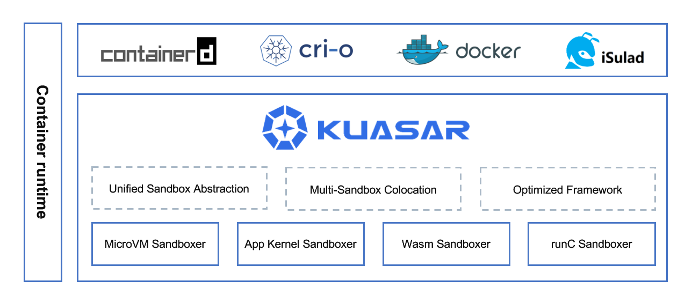
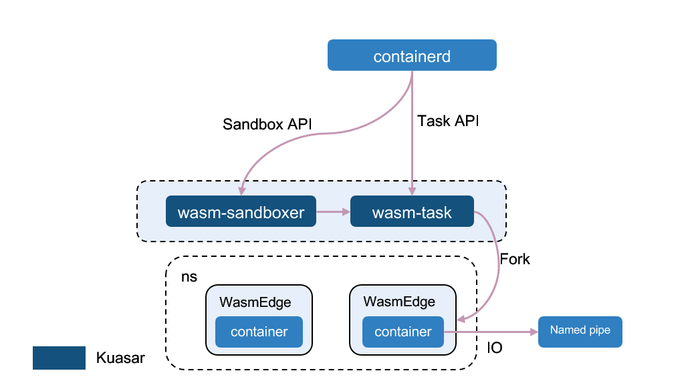

Kuasar is an efficient container runtime that provides cloud-native, all-scenario container solutions by supporting multiple sandbox techniques. Written in Rust, it offers a standard sandbox abstraction based on the sandbox API. Additionally, Kuasar provides an optimized framework to accelerate container startup and reduce unnecessary overheads.

# Why Kuasar?

In the container world, a sandbox is a technique used to separate container processes from each other, and from the operating system itself. After the introduction of the [Sandbox API](https://github.com/containerd/containerd/issues/4131), sandbox has become the first-class citizen in containerd. With more and more sandbox techniques available in the container world, a management service called "sandboxer" is expected to be proposed.

Kuasar supports various types of sandboxers, making it possible for users to select the most appropriate sandboxer for each application, according to application requirements.

Compared with other container runtimes, Kuasar has the following advantages:

+ **Unified Sandbox Abstraction**: The sandbox is a first-class citizen in Kuasar as the Kuasar is entirely built upon the Sandbox API, which was previewed by the containerd community in October 2022. Kuasar fully utilizes the advantages of the Sandbox API, providing a unified way for sandbox access and management, and improving sandbox O&M efficiency.
+ **Multi-Sandbox Colocation**: Kuasar has built-in support for mainstream sandboxes, allowing multiple types of sandboxes to run on a single node. Kuasar is able to balance user's demands for security isolation, fast startup, and standardization, and enables a serverless node resource pool to meet various cloud-native scenario requirements.
+ **Optimized Framework**: Optimization has been done in Kuasar via removing all pause containers and replacing shim processes by a single resident sandboxer process, bringing about a 1:N process management model, which has a better performance than the current 1:1 shim v2 process model. The benchmark test results showed that Kuasar's sandbox startup speed 2x, while the resource overhead for management was reduced by 99%. More details please refer to [Performance](#Performance).
+ **Open and Neutral**: Kuasar is committed to building an open and compatible multi-sandbox technology ecosystem. Thanks to the Sandbox API, it is more convenient and time-saving to integrate sandbox technologies. Kuasar keeps an open and neutral attitude towards sandbox technologies, therefore all sandbox technologies are welcome. Currently, the Kuasar project is collaborating with open-source communities and projects such as WasmEdge, openEuler and QuarkContainers.

# Kuasar Architecture



Sandboxers in Kuasar use their own isolation techniques for the containers, and they are also external plugins of containerd built on the new sandbox plugin mechanism. A discussion about the sandboxer plugin has been raised in this [Containerd issue](https://github.com/containerd/containerd/issues/7739), with a community meeting record and slides attached in this [comment](https://github.com/containerd/containerd/issues/7739#issuecomment-1384797825). Now this feature has been put into 2.0 milestone.

Currently, Kuasar provides three types of sandboxers - **MicroVM Sandboxer**, **App Kernel Sandboxer** and **Wasm Sandboxer** - all of which have been proven to be secure isolation techniques in a multi-tenant environment. The general architecture of a sandboxer consists of two modules: one that implements the Sandbox API to manage the sandbox's lifecycle, and the other that implements the Task API to handle operations related to containers.

Additionally, Kuasar is also a platform under active development, and we welcome more sandboxers can be built on top of it, such as Runc sandboxer.

## MicroVM Sandboxer

In the microVM sandbox scenario, the VM process provides complete virtual machines and Linux kernels based on open-source VMMs such as [Cloud Hypervisor](https://www.cloudhypervisor.org/), [StratoVirt](https://gitee.com/openeuler/stratovirt), [Firecracker](https://firecracker-microvm.github.io/) and [QEMU](https://www.qemu.org/). Hence, the `vmm-sandboxer` of MicroVM sandboxer is responsible for launching VMs and calling APIs, and the `vmm-task`, as the init process in VMs, plays the role of running container processes. The container IO can be exported via vsock or uds.

The microVM sandboxer avoids the necessity of running shim process on the host, bringing about a cleaner and more manageable architecture with only one process per pod.


*Please note that only Cloud Hypervisor, StratoVirt and QEMU are supported currently.*

## App Kernel Sandboxer

The app kernel sandbox launches a KVM virtual machine and a guest kernel, without any application-level hypervisor or Linux kernel. This allows for customized optimization to speed up startup procedure, reduce memory overheads, and improve IO and network performance. Examples of such app kernel sandboxes include [gVisor](https://gvisor.dev/) and [Quark](https://github.com/QuarkContainer/Quark).

Quark is an application kernel sandbox that utilizes its own hypervisor named `QVisor` and a customized kernel called `QKernel`. With customized modifications to these components, Quark can achieve significant performance.

The `quark-sandboxer` of app kernel sandboxer starts `Qvisor` and an app kernel named `Qkernel`. Whenever containerd needs to start a container in the sandbox, the `quark-task` in `QVisor` will call `Qkernel` to launch a new container. All containers within the same pod will be running within the same process.


*Please note that only Quark is currently supported.*

## Wasm Sandboxer

The wasm sandbox, such as [WasmEdge](https://wasmedge.org/) or [Wasmtime](https://wasmtime.dev/), is incredibly lightweight, but it may have constraints for some applications at present. The `wasm-sandboxer` and `wasm-task` launch containers within a WebAssembly runtime. Whenever containerd needs to start a container in the sandbox, the `wasm-task` will fork a new process, start a new WasmEdge runtime, and run the Wasm code inside it. All containers within the same pod will share the same Namespace/Cgroup resources with the `wasm-task` process.


*Please note that only WasmEdge is currently supported.*

# Performance

The performance of Kuasar is measured by two metrics:

+ End-to-End containers startup time.
+ Process memory consumption to run containers.

We used the Cloud Hypervisor in the benchmark test and tested the startup time of 100 PODs under both serial and parallel scenario. The result demonstrates that Kuasar outperforms open-source [Kata-containers](https://github.com/kata-containers/kata-containers) in terms of both startup speed and memory consumption.

For detailed test scripts, test data, and results, please refer to the [benchmark test](tests/benchmark/Benchmark.md). 

# Quick Start

## Prerequisites

### 1. OS
The minimum versions of Linux distributions supported by Kuasar are *Ubuntu 22.04* or *CentOS 8* or openEuler 23.03. 

Please also note that Quark requires a Linux kernel version >= 5.15.

### 2. Sandbox

+ MicroVM: To launch a microVM-based sandbox, a hypervisor must be installed on the host. 
  + It is recommended to install Cloud Hypervisor by default. You can find Cloud Hypervisor installation instructions [here](https://github.com/cloud-hypervisor/cloud-hypervisor/blob/main/docs/building.md).
  + If you want to run kuasar with iSulad container engine and StratoVirt hypervisor, you can refer to this guide [how-to-run-kuasar-with-isulad-and-stratovirt](docs/vmm/how-to-run-kuasar-with-isulad-and-stratovirt.md).
+ Quark: To use Quark, please refer to the installation instructions [here](docs/quark/README.md).
+ WasmEdge: To start WebAssembly sandboxes, you need to install WasmEdge v0.11.2. Instructions for installing WasmEdge can be found in [install.html](https://wasmedge.org/book/en/quick_start/install.html).

### 3. containerd

Kuasar sandboxers are external plugins of containerd, so both containerd and its CRI plugin are required in order to manage the sandboxes and containers.

We offer two ways to interact Kuasar with containerd:

+ **EXPERIMENTAL in containerd 2.0 milestone**: If you desire the full experience of Kuasar, please install [containerd under kuasar-io organization](docs/containerd.md). Rest assured that our containerd is built based on the official v1.7.0, so there is no need to worry about missing any functionalities.

+ If the compatibility is a real concern, you need to install official containerd v1.7.0 with an extra [kuasar-shim](shim) for request forwarding, see [here](docs/shim/README.md). However, it's possible that this way may be deprecated in the future as containerd 2.0 evolves.

### 4. crictl

Since Kuasar is built on top of the Sandbox API, which has already been integrated into the CRI of containerd, it makes sense to experience Kuasar from the CRI level.

`crictl` is a debug CLI for CRI. To install it, please see [here](https://github.com/kubernetes-sigs/cri-tools/blob/master/docs/crictl.md#install-crictl)

### 5. virtiofsd

MicroVMs like Cloud Hypervisor needs a virtiofs daemon to share the directories on the host. Please refer to [virtiofsd guide](https://gitlab.com/virtio-fs/virtiofsd).

## Build from source

Rust 1.67 or higher version is required to compile Kuasar. Build it with root user:

```shell
git clone https://github.com/kuasar-io/kuasar.git
cd kuasar
make all
make install
```

## Start Kuasar

Launch the sandboxers by the following commands:

+ For vmm: `nohup vmm-sandboxer --listen /run/vmm-sandboxer.sock --dir /run/kuasar-vmm &`
+ For quark: `nohup quark-sandboxer --listen /run/quark-sandboxer.sock --dir /var/lib/kuasar-quark &`
+ For wasm: `nohup wasm-sandboxer --listen /run/wasm-sandboxer.sock --dir /run/kuasar-wasm &`

## Start Container

Since Kuasar is a low-level container runtime, all interactions should be done via CRI in containerd, such as crictl or Kubernetes. We use crictl as examples:

+ For vmm and quark, run the following scripts:

  `examples/run_example_container.sh vmm` or `examples/run_example_container.sh quark`

+ For wasm: Wasm container needs its own container image so our script has to build and import the container image at first.

  `examples/run_example_wasm_container.sh`

# Contact

If you have questions, feel free to reach out to us in the following ways:

- [mailing list](https://groups.google.com/forum/#!forum/kuasar)
- [slack](https://app.slack.com/client/T08PSQ7BQ/C052JRURD8V)

# Contributing

If you're interested in being a contributor and want to get involved in developing the Kuasar code, please see [CONTRIBUTING](CONTRIBUTING.md) for details on submitting patches and the contribution workflow.

# License

Kuasar is under the Apache 2.0 license. See the [LICENSE](LICENSE) file for details.

Kuasar documentation is under the [CC-BY-4.0 license](https://creativecommons.org/licenses/by/4.0/legalcode).
