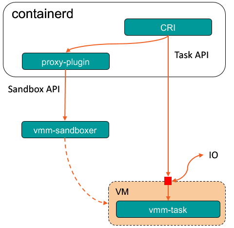

# Architecture
Kuasar-sandboxer is a sandboxer plugin of containerd. a sandboxer is a component of containerd for container sandbox lifecycle management. A sandbox should provides a set of task API to containerd for container lifecycle management. the `containerd-task-kuasar` the PID 1 process running in the vm launched by vmm-sandboxer, it provides task API with the vsock connection.


# Installation Guide

## Prerequisites
kuasar should be running on bare metal of x86_64 arch, HostOS should be linux with of 4.8 or higher, with hypervisor installed(qemu support currently, and cloud-hypervisor will be supported soon), Containerd with CRI plugin is also required. rust toolchains is required for compiling the source.

## Building from source

```sh
rustup target add x86_64-unknown-linux-musl
cargo build --target=x86_64-unknown-linux-musl --release
```

## Building guest kernel
Guest kernel should also be linux of 4.8 or higher, with virtio-vsock enabled, make sure [this patch](https://lore.kernel.org/all/20191122070009.5CE442068E@mail.kernel.org/T/) is merged.
```
CONFIG_VSOCKETS=y                            
CONFIG_VSOCKETS_DIAG=y
CONFIG_VIRTIO_VSOCKETS=y
CONFIG_VIRTIO_VSOCKETS_COMMON=y
```

## Building guest os image
The guest os can be either a busybox or any linux distributions, but make the sure that the `target/x86_64-unknown-linux-musl/release/containerd-task-kuasar` be the init process. and make sure runc is installed.

## Building containerd
git clone the codes of containerd fork version from kuasar repository. 
```bash
git clone xxxx
cd containerd
make bin/containerd
install bin/containerd /usr/bin/containerd
```

## Running with containerd
Install the vmm-sandboxer
```bash
cp target/x86_64-unknown-linux-musl/release/vmm-sandboxer /usr/local/bin/
```

add a sandboxer config in containerd config
```toml
[proxy_plugins]
  [proxy_plugins.kuasar]
    type = "sandbox"
    address = "/run/vmm-sandboxer.sock"
```

create a file named pod.json with content:
```json
{
    "metadata": {
        "name": "test-sandbox",
        "namespace": "default"
    },
    "log_directory": "/tmp",
    "linux": {
        "security_context": {
                "namespace_options": {
                        "network": 2
                }
        }
    }
}
```

create a file named container.json with content:

```json
{
  "metadata": {
      "name": "test-container"
  },
  "image":{
      "image": "ubuntu:latest"
  },
  "command": [
     "sh", "-c", "while true; do echo \`date\`; sleep 1; done"
  ],
  "log_path":"container.log",
}
```

create pod and container with crictl
```shell
podid=`crictl runp --runtime=kuasar pod.json`
containerid=`crictl create --no-pull $podid container.json pod.json`
crictl start $containerid
```

now container is running and you can access it with `crictl exec` command


